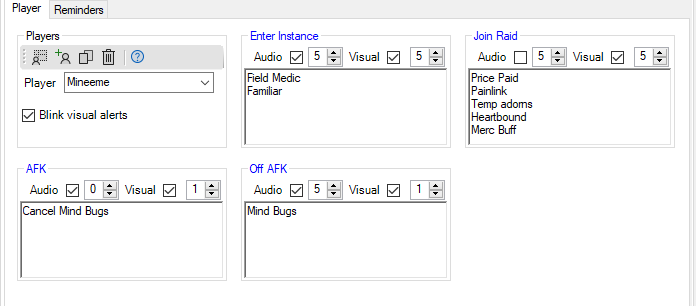
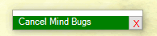
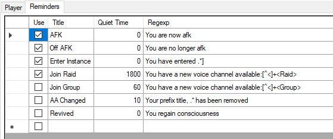

# ACT Reminders Plugin
This plugin provides audio and/or visual alerts triggered by in-game events. For example, maybe you want to stop auto-consuming something when you go afk. Or there's a buff you need to remember to cast when you enter an instance. Or a list of things to do when you join a raid.

Reminders are set per player. If the player name is not in the plugin's player list, reminders are not generated.

Version 1.0.1.0
* Fix overlapping reminders with different delays.
* Fix different reminders for different characters.

## Layout
The plugin consists of two tabs. 

The __Player__ tab allows for adding, deleting, and displaying players. It also displays and modifies the alert specifics for the selected player.

The __Reminders__ tab lists all of the regular expressions the plugin uses to compare to game log lines.

## Setup
If the plugin does not have any players in its player list (e.g. the first time it runs after installation), it will offer to add the current ACT player to its list and create some EQII example alerts. If the user declines the default setup, they will need to add player(s) using the buttons in the __Players__ box on the __Player__ tab and add regular expressions on the __Reminders__ tab.

## Player Tab
An example player tab with five alerts is shown below:

### Players Box
The __Players__ box adds, copies, deletes, and displays the plugin's list of players. The toolbar buttons modify the player list.

 adds ACT's current player (named in ACT's title bar) to its list of players

 adds the player name manually entered in the _Player_ textbox to its list of players

 prompts to copy the data for the currently displayed character named in the _Player_ textbox to a different (new or existing) player

 deletes the player named in the _Player_ textbox from its list of players

The _Player_ drop list shows all of the players for which the plugin generates alerts. The plugin generates alerts for the active player per ACT, regardless of which player is selected / displayed here.

When the _Blink visual alerts_ checkbox is checked, the visual alerts cycle between a green and gray background once per second.

### Reminder Boxes
For each reminder whose _Use_ checkbox is checked on the __Reminders__ tab, the plugin shows the player specific reminder details.

The blue title of the box is the user-defined cosmetic _Title_ of the reminder on the __Reminders__ tab.

The _Audio_ and _Visual_ sections consist of a checkbox and a time delay. 
* A checked checkbox enables that type of reminder for the selected player.
* The reminder itself is delayed by the displayed number of seconds in the numeric spinner. 
    * This can be useful for example when entering an instance and the triggering log line occurs before the player actually lands. Delay the alert until the player is actually able to do something about it.
* Visual reminders are dismissed by pressing their red X button.

The textbox defines the contents of the reminder. The plugin uses the text to generate both the audio and visual reminders. 

The plugin adds a comma after each line of text for the audio alert. Thus, the example above for the _Enter Instance_ reminder audio will be "Field Medic, Familiar", which sounds like "field medic(pause)familiar".

Each line of text results in a separate line in the visual reminder. The visual reminder grows or shrinks vertically to fit the number of lines but the width is set by the user.

## Reminder Tab
An example list of reminder regular expressions is shown below:

Check the _Use_ checkbox to activate that reminder for the currently selected player on the __Player__ tab. The checkmarks in this example match the reminders shown in the example __Player__ tab above.

The _Title_ is a user-defined cosmetic name for the reminder.

The _Quiet Time_ provides a means to filter out multiple occurrances of the log line in the specified timeframe. Once a match is made and a reminder is generated, duplicate reminders will not be generated for the given number of seconds. In the example, the _Join Raid_ reminder will alert on the first match, then will not alert again for 30 minutes (30*60 = 1800 seconds). This particular log line appears mutliple times in EQII as the raid leader moves you around among groups and upon zoning into a raid zone.

The _Regexp_ is the [regular expression](https://www.regular-expressions.info/) for matching log lines from the game. You can test regular expressions [here](https://regex101.com/). When modifying the regular expression, it must parse correctly before the cell can be exited. Any error will be described by hovering the mouse over the red exclamation mark at the end of the cell containing the error. (Note: it is best to start regular expressions with at least one fixed character rather than a wildcard. Starting with a wildcard takes around 25 to 100 times longer to process than starting with a fixed character.)

Add new reminders by typing in the blank line at the bottom.

Delete reminders by selecting the line and pressing the [Del] key.
